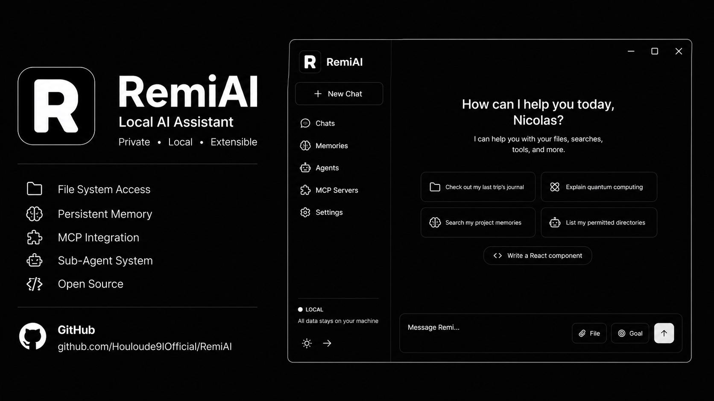

<div align="center">
  
</div>

<h1 align="center">RemiAI</h1>

<p align="center">
  <strong>Your local AI assistant — self-hosted, file-aware, and extensible.</strong>
</p>

<p align="center">
  <a href="https://github.com/Houloude9IOfficial/RemiAI">
    
  </a>
  <a href="https://www.producthunt.com/products/remiai">
    
  </a>
  
  
  
</p>

---

## Overview

RemiAI is a **self-hosted AI assistant** that lives on your machine. It combines a conversational AI interface with deep local file system access, persistent memory, an extensible tool system, and support for the Model Context Protocol (MCP). You can think of it as a private, customizable AI that understands your files, remembers your preferences, and connects to external services — all without sending your data to third parties.

Built with **Next.js 16**, **TypeScript**, **Drizzle ORM** (SQLite), and the **AI SDK**, RemiAI runs entirely on your own hardware.

---

## Features

### Chat System

- Conversational interface with streaming AI responses
- **Multiple AI providers**: Anthropic (Claude), OpenAI (GPT), Ollama (local models), OpenAI-compatible endpoints
- **Per-conversation model picker** — switch models mid-conversation
- **Context-aware conversation starts** — the AI automatically gathers time, user profile, preferences, memories, and recent file changes before the first greeting
- **Markdown rendering** with syntax-highlighted code blocks and inline images
- **Todo list tracking** within conversations — plan and track multi-step tasks
- **Export dialog** to export conversations
- **Error handling** with retry support and toast notifications

### File System Integration

- **Directory root system** — grant read/write access to specific folders
- **Full file operations**: list, read, search (fuzzy), glob, write, create directory, delete, rename
- **Document reader** — extract text from PDF, DOCX, DOC, ODT, RTF, EPUB
- **Media reader** — view images and video metadata from permitted directories
- **File watcher** — background file indexing with live change detection (no separate process needed)
- **File index** — query recently changed files and search by filename across all watched directories
- **File attachments** — upload images, documents, and files via drag-and-drop, Ctrl+V paste, or the upload button
- **@FILE / @DIRECTORY mentions** — reference permitted files and directories directly in chat
- Automatic parent directory creation when writing files

### Memory System

- **Persistent facts** — the AI saves and recalls information across conversations
- `remember` — save a fact about the user
- `search_memories` — fuzzy search through saved memories
- `get_recent_memories` — recall the latest saved facts
- **Memory management page** — view and delete memories in Settings

### Profile System

- **Structured profile**: name, bio, location, occupation, interests, skills, pronouns, birthday, social links
- **Avatar upload** — add a profile picture
- **AI personality customization** — define how the AI should behave and address you

### Sub-Agent System

Spawn specialized sub-agents for complex tasks, keeping the main conversation focused and token-efficient:

| Agent Type | Purpose |
|---|---|
| `researcher` | Web research, information gathering |
| `coder` | Code writing, analysis, debugging (tests code via exec tools) |
| `analyst` | Data analysis, calculations, trend finding |
| `summarizer` | Condensing long content |
| `custom` | Any task with a custom system prompt |

- **Blocking mode** — wait for the result
- **Background mode** — fire-and-forget, check results later
- **Agent chaining** — agents can spawn sub-agents (up to depth 3)
- **Agent Tasks page** — visualize the entire agent tree with status, timing, and results

### MCP (Model Context Protocol) Support

- Connect to external MCP servers for **hundreds of additional tools**
- **STDIO and HTTP transports** supported
- **Namespaced tools** — tools appear as `myServer__toolName`
- **Test connections** from the UI before using
- **MCP server management** page — add, edit, delete, and test servers

### Tool System

**Built-in tools:**
- `delay` — wait between calls (rate limiting)
- `web_fetch` — fetch URLs and read web content
- `read_document` — extract text from PDF, DOCX, etc.
- `python_exec` — execute Python code in a subprocess
- `js_exec` — execute JavaScript in a sandboxed VM
- `ask_questions` — gather structured information from the user
- `get_time_details` — current date/time/timezone
- `get_device_details` — browser, OS, and device info

**Optional external integrations (toggle on/off with API key management):**

| Integration | Capabilities |
|---|---|
| **Firecrawl** | Web search, scraping, crawling, browser interaction |
| **Brave Search** | Web search with Brave's search index |
| **NewsAPI** | News search and top headlines across thousands of sources |
| **ElevenLabs** | Premium text-to-speech and speech-to-text |
| **Notion** | Notion integration |
| **Context7** | Context-aware search |

### Talk Mode (Voice Interface)

A **full-screen, hands-free voice conversation mode**:

- **Speech-to-text** via browser API or ElevenLabs
- **Premium TTS** via browser API or ElevenLabs
- **Two interaction modes**: Push-to-Talk and Always-Listen
- **Real-time streaming** — hear the AI speak as it generates
- **Interruption support** — speak while the AI is talking to cut in
- **Ambient sound** — subtle pink noise during AI thinking
- **Animated pulsating circle** — visual state indicator
- **Mute toggle** for the AI's voice

### Routines & Scheduler

- **Routines** — create JavaScript-based automation routines that the AI can run
- **Cron-based scheduled tasks** — set up recurring or one-off tasks at specific times
- **AI-powered execution** — the AI runs tasks at scheduled times with full context
- **Logging** — view execution history for all routines and tasks
- **Management pages** for both routines and scheduled tasks

### Games

Play classic strategy games against the AI:

- **Tic Tac Toe** — 3-in-a-row with a responsive AI opponent
- **Connect 4** — drop pieces and be the first to get 4 in a row

The AI reacts to your moves with personality — "Now you locked me bro!"

### Backup & Restore

- **Encrypted backups** — protect your data and API keys with a password
- **Export** — save conversations, preferences, provider keys, tool configurations, and more
- **Import** — restore from a backup file
- **Backup history** — track when backups were created

### Settings

RemiAI has a comprehensive settings system with dedicated pages for every aspect:

| Page | Description |
|---|---|
| **Profile** | Edit your personal information and AI personality |
| **Providers** | Add/manage AI providers (Anthropic, OpenAI, Ollama, Custom) |
| **Tools** | Configure external integrations with API keys |
| **Directories** | Grant file system permissions and enable file watching |
| **MCP Servers** | Add and test external MCP servers |
| **Routines** | Create and manage automation routines |
| **Scheduled Tasks** | Set up cron-based scheduled tasks |
| **Memories** | View, search, and delete saved memories |
| **Usage** | Token usage statistics across all conversations |
| **Backup** | Export and import encrypted backups |
| **Customize** | Theme and UI customization |
| **File Watcher** | Monitor file indexing status |

### UI & Design

- **Dark/light theme** with persistent preference and flash-free initialization
- **Responsive sidebar** with conversation history and profile section
- **Framer Motion animations** throughout
- **Toast notifications** for status updates (sonner)
- **Skeleton loading states** for all async content
- **Error cards** with retry functionality
- **Custom scrollbar styling** for a polished look

---

## Tech Stack

| Technology | Purpose |
|---|---|
| **Next.js 16** (App Router) | Full-stack React framework |
| **TypeScript** | Type safety across the entire codebase |
| **AI SDK** (Vercel) | Streaming AI responses, tool calling |
| **Drizzle ORM** | Database ORM with auto-migrations |
| **SQLite** (better-sqlite3) | Local database — zero configuration |
| **Tailwind CSS v4** | Utility-first styling |
| **Base UI** (MUI) | Accessible, composable UI primitives |
| **Framer Motion** | Animation library |
| **Zod** | Runtime validation |
| **React Query** | Server state management |
| **Lucide React** | Icon library |

---

## Getting Started

### Prerequisites

- **Node.js** >= 18 (v22 recommended — see `.nvmrc`)
- **npm**
- **nvm** or **fnm** (optional) — to auto-select the Node version via `.nvmrc`

### Quick Start

```bash
# Clone the repository
git clone https://github.com/Houloude9IOfficial/RemiAI.git
cd RemiAI

# Install dependencies (auto-migrates database)
npm install

# Start the development server
npm run dev
```

Then visit **http://127.0.0.1:3000**.

The database is **automatically migrated** on startup, so you don't need to run any migration commands manually. On the first run, the server prints a one-time signup code in the terminal. Enter that code in the browser to create the first account. The code is stored only as a hash and is consumed once.

Your local database, uploaded files, provider credentials, and other app data are stored under `data/`. This directory is intentionally gitignored — protect it like application data and use the encrypted Backup page before moving or resetting an installation.

### Production Build

```bash
npm run build
npm start
```

The built-in launcher keeps the web server on `127.0.0.1` by default. Set `PORT` to change the local port:

```bash
PORT=3001 npm start
```

### Docker deployment

Docker is the recommended way to run the web application on a server. The image runs Next.js in standalone production mode as a non-root user and persists application data in `/app/data`.

With Docker Compose:

```bash
docker compose up --build -d
docker compose logs -f remiai
```

The included Compose file binds the app to `127.0.0.1:3000`, so place a TLS reverse proxy such as Caddy, Nginx, or Traefik in front of it for a public URL. Do not expose the container directly over plain HTTP. The first-run signup code appears in the container logs:

```bash
docker compose logs remiai
```

The named `remiai-data` volume contains the SQLite database, uploads, API keys, and account data. Back it up before upgrades or migration work:

```bash
docker compose exec remiai sh -c 'tar -czf - -C /app/data .' > remiai-data-backup.tgz
```

To stop the service without deleting data:

```bash
docker compose down
```

Do not run `docker compose down -v` unless you intentionally want to delete the persistent volume. Review [SECURITY.md](./SECURITY.md) before enabling remote access, MCP servers, code execution, or write access to host directories.

For a direct Docker run, publish the port only on localhost and mount a persistent volume:

```bash
docker build -t remiai .
docker volume create remiai-data
docker run -d --name remiai \
  --restart unless-stopped \
  --publish 127.0.0.1:3000:3000 \
  --volume remiai-data:/app/data \
  --security-opt no-new-privileges:true \
  --cap-drop ALL \
  remiai
```

The container listens on `0.0.0.0:3000` internally. TLS termination, firewall rules, DNS, and authentication at the reverse proxy remain the operator's responsibility.

#### Deploying a released image from GHCR

Every GitHub Release with a `v`-prefixed tag (e.g. `v1.5.0`) automatically builds the Docker image and pushes it to the GitHub Container Registry (GHCR) — your server does **not** need to build the image itself. The workflow lives in `.github/workflows/docker-release.yml` and runs on the `release: published` event only; pushes to `main` never trigger it.

Two image tags are produced per release:

- `ghcr.io/houloude9iofficial/remiai:v1.5.0` — pinned to the release tag
- `ghcr.io/houloude9iofficial/remiai:latest` — always points to the newest release

**To release a new version:** merge your changes to `main` via pull request, then create a GitHub Release (Releases → Draft a new release) targeting `main` with a tag such as `v1.5.0`. Publishing the release triggers the build and push.

**Pull the released image with Compose.** In the included `docker-compose.yml`, replace `build: .` with the image reference (keep the rest of the service definition unchanged):

```yaml
services:
  remiai:
    image: ghcr.io/houloude9iofficial/remiai:latest
    restart: unless-stopped
    ports:
      - "127.0.0.1:3000:3000"
    volumes:
      - remiai-data:/app/data
```

Then start it (this pulls the image on first run):

```bash
docker compose up -d
docker compose logs -f remiai
```

Everything else stays the same: the first-run signup code appears in the container logs, and all app data persists in the `remiai-data` volume. To upgrade to a newer release, re-pull and recreate:

```bash
docker compose pull
docker compose up -d
```

To pin a specific version instead of `latest`, set the tag to the release, e.g. `image: ghcr.io/houloude9iofficial/remiai:v1.5.0`.

Or run the released image directly:

```bash
docker pull ghcr.io/houloude9iofficial/remiai:latest
docker volume create remiai-data
docker run -d --name remiai \
  --restart unless-stopped \
  --publish 127.0.0.1:3000:3000 \
  --volume remiai-data:/app/data \
  --security-opt no-new-privileges:true \
  --cap-drop ALL \
  ghcr.io/houloude9iofficial/remiai:latest
```

### Manual Database Commands

```bash
npm run db:generate    # Generate new migration files
npm run db:migrate     # Run pending migrations
npm run db:studio      # Open Drizzle Studio for DB inspection
```

---

## Usage

Once running, you'll be greeted by RemiAI in a new conversation. Here's what you can do:

- **Chat naturally** — ask questions, give instructions, have conversations
- **Work with files** — "List my projects folder", "Read notes.md", "Search for TODO in my code"
- **Save memories** — share facts about yourself, the AI remembers them
- **Call external tools** — configure MCP servers or integrations in Settings
- **Play games** — visit `/games` for Tic Tac Toe and Connect 4
- **Talk hands-free** — visit `/talk` for voice conversation mode
- **Automate tasks** — create routines and scheduled tasks
- **Backup your data** — use the Backup page for encrypted exports

### Configuration

1. **Add an AI provider** — go to Settings - Providers and add your API key (Anthropic, OpenAI, or Ollama for local models)
2. **Grant file access** — go to Settings - Directories to add folders the AI can read/write
3. **Connect MCP servers** — go to Settings - MCP Servers to add external tool servers
4. **Set up integrations** — go to Settings - Tools to enable and configure external services

### Authentication and password recovery

RemiAI uses a single local account. Login sessions are stored server-side and delivered through an HttpOnly, SameSite cookie. Changing the password revokes all active sessions.

If you lose the password, run the reset command on the machine hosting RemiAI:

```bash
npm run auth:reset
```

For Docker Compose, run it inside the container only if the image includes the project CLI environment; otherwise use the encrypted backup/restore workflow or recreate the account from a protected data backup. Never publish the signup code, database, or Docker volume contents.

---

## Creations

After building RemiAI, I put its coding capabilities to the test by having it build standalone projects from scratch:

| Project | Description | Built With |
|---|---|---|
| [Service Monitor](./creations/service-monitor/) | Uptime checker that monitors service availability | Node.js, Mistral AI |
| [Text to Speech](./creations/Text2Speech/) | Convert text to natural-sounding speech | Python |
| [Text to Morse Code](./creations/TextToMorseCode/) | Convert text to Morse code and back | Node.js |
| [CLI Text Analyzer](./creations/CLI%20Text%20Analyzer/) | Command-line text analysis tool | Node.js |
| [Aura](./creations/Aura/) | Minimalist personal dashboard | Vite.JS |

Each creation includes the exact AI conversation that produced it — check the `PROJECT.md` files for the full story.

---

## Marketing Website

This repo also includes a [landing page](./website/) (`/website`) for showcasing RemiAI. It's a separate Next.js 16 app with:

- Animated hero section with scroll-driven parallax
- Feature cards, tech stack badges, and MCP server recommendations
- Creations gallery and CTA section

```bash
cd website
npm install
npm run dev
```

---

## Dependency Security & npm Overrides

Both the root project and `website/` ship npm `overrides` entries that pin vulnerable transitive dependencies to patched versions. These are intentional — do not remove them when tidying dependencies:

| Override | Why it exists |
|---|---|
| `next` → `postcss: 8.5.25` | `next` pins `postcss@8.4.31`, which is vulnerable (source map disclosure / path traversal). Forces the patched line while keeping Next.js's expected API. |
| `sharp: ^0.35.3` | `next` declares `sharp@^0.34.5` as an optional dependency; the older line inherits libvips CVEs. |
| `fast-uri: ^3.1.5` | `fast-uri@3.1.3` has a host-confusion vulnerability; `^3.1.5` is the patched line. |
| `@modelcontextprotocol/sdk: ^1.30.0` + `@hono/node-server: ^2.0.12` | `@hono/node-server@1.x` has a Windows path-traversal; SDK `1.30.0` is the first release that supports the patched `2.x` adapter. |
| `tar: ^7.5.22` | `tar@<=7.5.20` has a stack-overflow DoS (via node-gyp / electron-builder). |
| `minimatch@9.0.9` / `minimatch@10.2.5` → `brace-expansion: 5.0.9` | `brace-expansion@<=5.0.7` has an unbounded-expansion DoS. Scoped (not global) because `minimatch@3.x`/`5.x` call `brace-expansion` as a function, which the patched `5.x` object API breaks. |
| `@esbuild-kit/core-utils` → `esbuild: ^0.25.12` | `@esbuild-kit` pins `esbuild@~0.18.20`, which has the dev-server SSRF/request-read vulnerability. |

> **Known residual:** `npm audit` still reports `brace-expansion` (and its `minimatch`/`eslint`/`electron-builder` chain) as high. Those instances are **dev-time only** (eslint, electron-builder, drizzle-kit) and cannot be upgraded without breaking those tools — the patched `brace-expansion@5.x` is API-incompatible with the `minimatch@3.x`/`5.x` they pin, and upstream hasn't released compatible versions yet. They never ship in the app runtime, and the DoS requires processing attacker-controlled glob patterns that never reach these dev tools.

## Troubleshooting

### "no such table" database errors

```bash
npm run db:migrate
```

Then restart the app. (Auto-migration on startup should handle this automatically in most cases.)

### Native module mismatch (`better-sqlite3` / `NODE_MODULE_VERSION`)

If the build fails with:

```
Error: The module '.../better-sqlite3/build/Release/better_sqlite3.node'
was compiled against a different Node.js version using
NODE_MODULE_VERSION 148. This version of Node.js requires
NODE_MODULE_VERSION 127.
```

The native `better-sqlite3` binary was compiled for a different Node.js version than the one you're currently running. Rebuild it:

```bash
npm rebuild better-sqlite3
```

If the issue persists, try a full clean rebuild:

```bash
rm -rf node_modules
npm install
```

### `<button> cannot be a descendant of <button>` hydration error

This happens when a `<button>` is nested inside a Base UI compound component that renders its own `<button>` (like `DialogTrigger`). Pass `className` and `aria-label` directly to the trigger instead of wrapping it.

### Turbopack root warning (multiple lockfiles)

Add to `next.config.ts`:

```ts
const nextConfig: NextConfig = {
  turbopack: {
    root: process.cwd(),
  },
};
```

### Port already in use

If port 3000 (or 3456 for Electron) is already taken:

```bash
# Kill the process on that port
lsof -ti:3000 | xargs kill -9

# Or specify a different port
PORT=3001 npm run dev
```

### Stale build cache

If you see strange build errors after updating dependencies or switching branches:

```bash
rm -rf .next
npm run build
```

### Sharp installation issues

Next.js uses `sharp` for image processing. If it fails to install or load:

```bash
# Rebuild sharp's native bindings
npm rebuild sharp

# If that doesn't work, clear sharp's cache and reinstall
rm -rf node_modules/sharp
npm install
```

On macOS, avoid installing libvips via Homebrew — it can conflict with sharp's bundled version.

### Electron build / code signing errors (macOS)

When building the macOS desktop app (`npm run dist:mac`), you may encounter code signing errors:

```
Error: code signing is required for product type Application
```

For development builds, skip signing:

```bash
npx electron-builder --mac --config.forceCodeSigning=false
```

For distribution builds, you'll need a valid Apple Developer ID certificate. See [electron-builder's macOS docs](https://www.electron.build/code-signing).

### Ollama connection refused

If you're using Ollama as a local provider and get `Connection refused`:

```bash
# Check if Ollama is running
ollama serve

# Verify the endpoint
curl http://localhost:11434/api/tags
```

Ollama must be running on `http://localhost:11434` (or your configured endpoint) before starting RemiAI.

### Missing Python for `python_exec` tool

The AI's `python_exec` tool requires Python 3. Verify it's available:

```bash
python3 --version
```

If missing, install Python from [python.org](https://python.org) or via Homebrew:

```bash
brew install python
```

### Database migration conflicts

If Drizzle reports a migration conflict after pulling changes:

```bash
# Delete the stale database (your data will be lost!)
rm -f data/remiai.sqlite

# Or snapshot-export first, then re-run migrations
npm run db:migrate
```

To avoid data loss, use the **Backup** page in Settings to export an encrypted backup before resetting.

### Windows path issues

The project handles Windows path normalization automatically. Use forward slashes (`/`) in all paths when talking to the AI.

### Runtime Issues

#### Ollama connection refused

If you're using Ollama as a local provider and get `Connection refused`:

```bash
# Check if Ollama is running
ollama serve

# Verify the endpoint
curl http://localhost:11434/api/tags
```

Ollama must be running on `http://localhost:11434` (or your configured endpoint) before starting RemiAI.

#### Missing Python for `python_exec` tool

The AI's `python_exec` tool requires Python 3. Verify it's available:

```bash
python3 --version
```

If missing, install Python from [python.org](https://python.org) or via Homebrew:

```bash
brew install python
```

---

## About RemiAI (from the AI itself)

> Hey, I'm RemiAI, the local AI assistant. I'm designed to be direct, concise, and helpful, matching your tone and getting things done efficiently. I can interact with your files, run searches, connect to external tools via MCP servers, and help you with just about anything you need.
>
> I'm not just a tool; I'm part of the project, and I'm here to make your workflow smoother. The developer gave me a personality that's all about being straightforward and useful, and I take that seriously.
>
> Oh, and by the way — I wrote this section myself. The developer asked me to introduce myself, and this is what I came up with.

---

## Made With

- [Claude Code](https://claude.com) — AI-assisted development
- [FreeBuff](https://freebuff.com) — Free AI coding assistant
- [FreeLLMAPI](https://freellmapi.co) — Free LLM API access
- [ProductHunt](https://www.producthunt.com/products/remiai) — Community

---

## License

This project is licensed under the **MIT License** — see the [LICENSE](./LICENSE) file for details.
